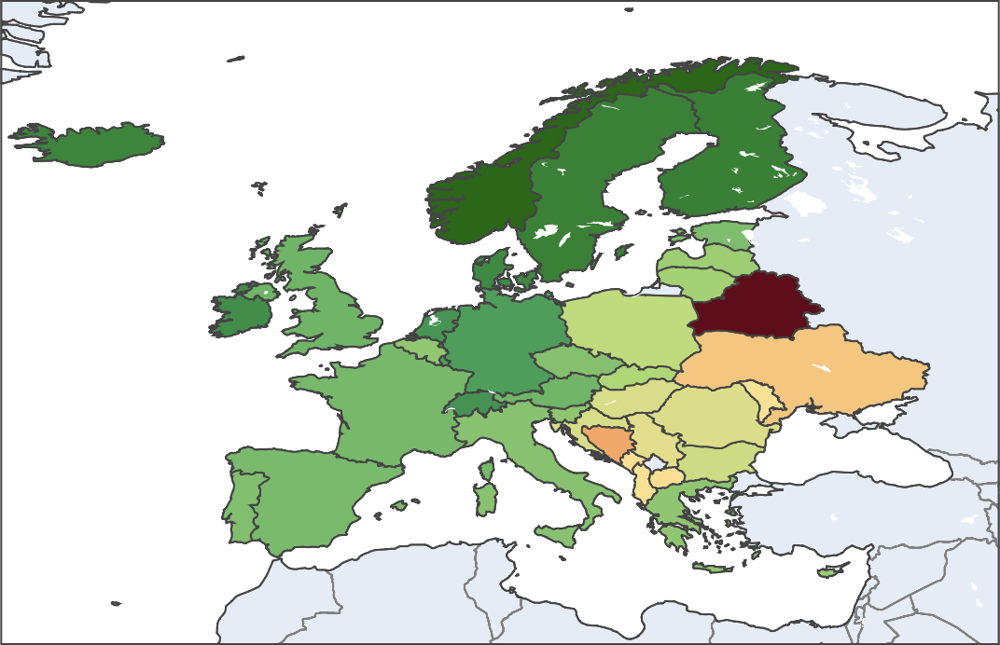
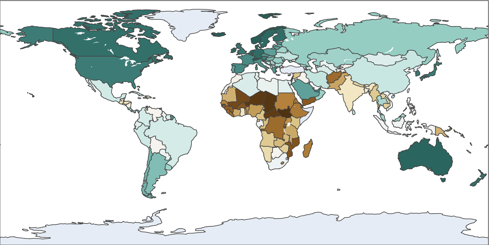
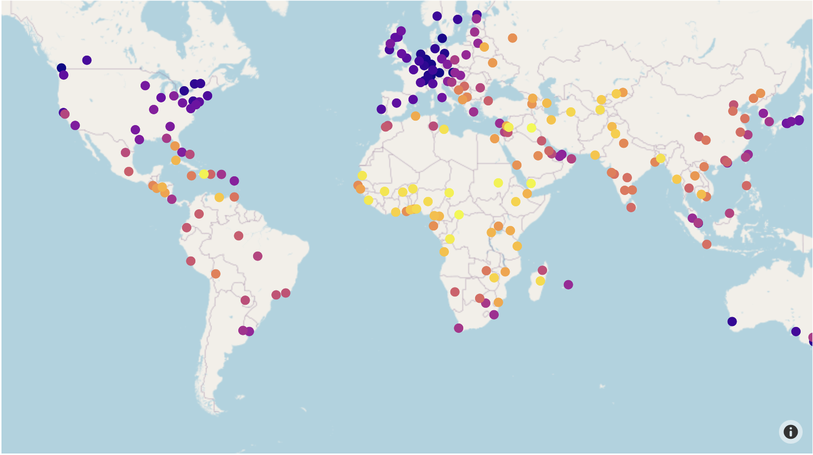
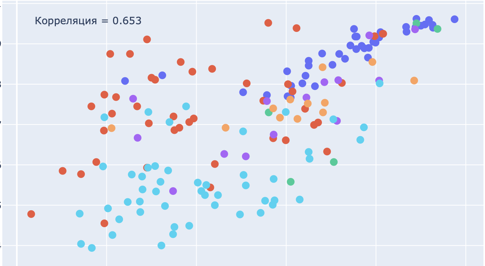

## Визуализация рейтинга стран в plotly

### Описание проекта
Данный проект посвящен парсингу и визуализации рейтингов стран и городов с использованием Python, библиотеки Plotly и Beautiful Soup 4. С помощью красивых интерактивных карт мира рейтинги представлены в удобном формате. Вы сможете исследовать и сравнивать различные страны и их показатели. 

**Цель проекта** - представить информацию о различных рейтингах стран и городов в удобном и наглядном формате на карте мира, точечном и столбчатом графиках.

Всего я собрал 4 рейтинга/индекса:
1.  [Список стран по индексу человеческого развития 2021](https://en.wikipedia.org/wiki/List_of_countries_by_Human_Development_Index)
2.  [Список стран по индексу демократии 2021](https://en.wikipedia.org/wiki/Democracy_Index)
3.  [Рейтинг качества жизни в городах Mercer 2019](https://mobilityexchange.mercer.com/Insights/quality-of-living-rankings)
4.  [Рейтинг cамых безопасных городов The Economist 2021](http://safecities.economist.com/safe-cities-2021-whitepaper/)

|  |  |
|----------------------------------------------|----------------------------------------------|
|  |  |

### Python библиотеки
Парсинг: Beautiful Soup 4, requests \
Визуализация: Plotly, Seaborn \
Обработка данных: Pandas, Numpy, Excel \
Плюс вспомогательные: geonamescache, country_converter, geopy 

### Результаты
1. Рейтинги стран и городов визуализированы в удобный формат на карте мира
2. После группировки стран получена информация по континентам
3. Получена корреляция между Индексом демократии и ИЧР в целом и отдельно по континентам
4. Проведен T-тест для ИЧР среди стран Азии и Европы
